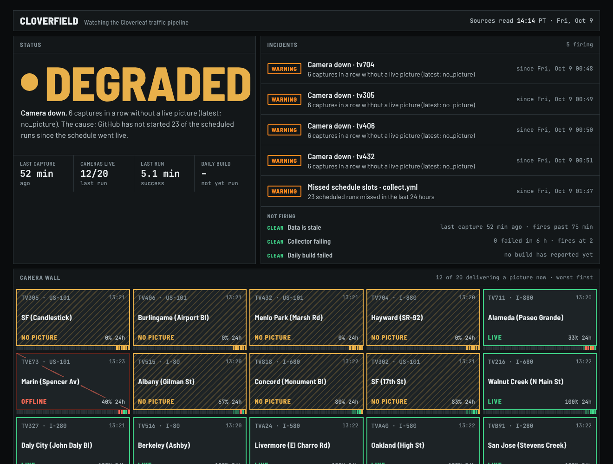

# Cloverfield

**Is Cloverleaf working right now, and how reliably has it worked?** Cloverfield monitors [Cloverleaf](https://github.com/evannwilsonn/cloverleaf), a pipeline that records live Caltrans camera video every 30 minutes and turns it into traffic data. It watches from the outside, using only evidence Cloverleaf leaves behind:
- GitHub's record of every workflow run, job and step
- the capture files and dbt build results on Cloverleaf's `data` branch

From those it computes service-level objectives over 24 hours and 7 days, raises alerts that clear themselves, and shows which cameras delivered a picture.



## What it caught on day one (Oct 9 2026)

- **GitHub barely ran the schedule.** Cloverleaf's collector is scheduled every 30 minutes. Of 25 slots, a run started within 15 minutes of the slot only once (4%, against a 90% target). GitHub fired a handful of scheduled runs hours apart, and the rest came from manual dispatches.
- **Cameras.** 68% of captures had a live picture, against an 85% target. Four US-101 and I-880 cameras showed Caltrans' "No video" card or a black frame for six captures in a row, so a "camera down" alert fired for each. One Marin camera was offline.
- **The collector works when it runs.** All runs finished within 15 minutes. One of five failed, and that was the first run on day one.

The page says **Degraded** with the reason in one line. Without the scheduling gaps it would read Healthy.

## How it works

1. **Extract** (`ingest/extract.py`). Pulls:
   - workflow runs and jobs from the GitHub REST API, cached per finished run
   - an archive of Cloverleaf's `data` branch
   - the camera list

   Every file is recorded in a SHA-256 manifest.
2. **Load** (`ingest/load_raw.py`). The extracted files land unchanged in `raw_github.*` and `raw_cloverleaf.*` (DuckDB, or Snowflake).
3. **Model** (dbt):
   - staging
   - a schedule spine (`int_schedule_slots`), which turns each workflow's cron into its expected slots from the time the schedule went live
   - core facts: slots, runs, camera captures and dbt builds
   - reporting: `rpt_slo`, `rpt_alerts`, `rpt_status_now`, the camera grid and uptime, schedule by day, runs, builds

   Objectives and alert rules are seeds (`seeds/slos.csv`, `seeds/alert_rules.csv`), and thresholds are dbt vars. There are 21 dbt tests.
4. **Publish.** `dashboard/export_data.py` writes one JSON file for the static status page. Every age shown is measured from when Cloverfield last read its sources, not from page load.

**Objectives:**
- Collector on schedule
- Collector succeeds
- Collector finishes in time
- Cameras delivering a picture
- Fresh data every hour

**Alerts:**
- Data is stale (critical)
- Collector failing (critical)
- Daily build failed (critical)
- Camera down (warning)
- Missed schedule slots (warning)

## Run it

```
pip install -r requirements.txt
make all        # extract, load, dbt build, export (DuckDB)
make serve      # http://localhost:8000
```

On Snowflake (key-pair sign-in, database `CLOVERFIELD`):

```
python ingest/load_snowflake.py --duckdb warehouse/cloverfield.duckdb --database CLOVERFIELD --schemas raw_github,raw_cloverleaf
dbt build --profiles-dir . --target snowflake
python dashboard/export_data.py --target snowflake
```

`.github/workflows/monitor.yml` runs hourly at :52. It uses Snowflake every sixth hour when the Snowflake secrets exist, and DuckDB otherwise. It deploys to GitHub Pages when the repository variable `PAGES_ENABLED` is `true`.

## Limits

- **History.** History starts on Oct 9 2026, so the 7-day windows equal the 24-hour windows for now.
- **Self-monitoring.** Cloverfield runs on the same GitHub scheduler it reports on, so when GitHub skips runs, Cloverfield's own page refreshes less often too. The page shows the time it last read its sources so this stays visible.
